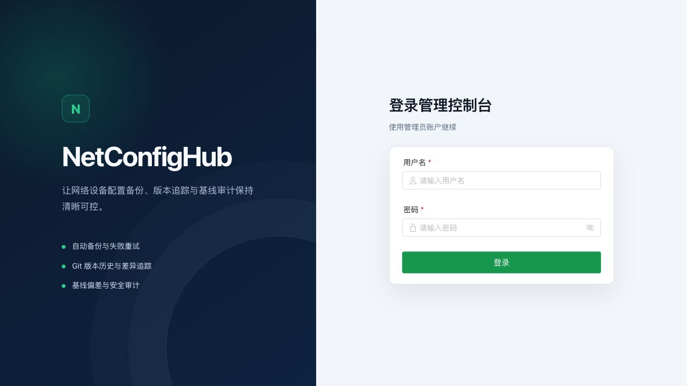
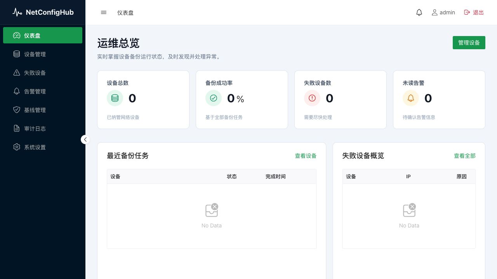
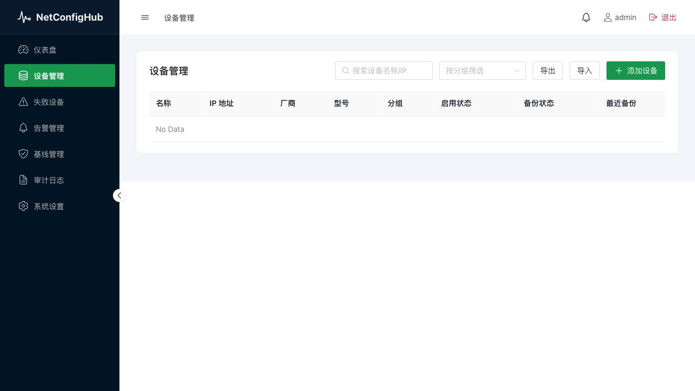

# NetConfigHub

English | [中文文档](README.zh-CN.md)

NetConfigHub is a network device configuration backup and management platform for
small and mid-sized network operations teams. It provides a Go backend, embedded
Vue web UI, REST APIs, scheduled/manual backup jobs, Git-backed configuration
history, baseline comparison, alerts, hooks, audit logs, and API-token access.

## Features

- Device CRUD with enable/disable, grouping, import, and export.
- SSH/Telnet collectors for Cisco, Huawei, H3C, and Ruijie style devices.
- Manual and scheduled backup jobs with retry handling.
- Git-backed configuration storage and diff/history APIs.
- Baseline management and deviation reporting.
- Alert, webhook, failed-device, audit-log, and system-config APIs.
- Embedded web UI served by the Go binary.
- SQLite by default, with MySQL configuration support.
- Docker Compose and systemd deployment examples.

## Demo

### Login



### Operations dashboard



### Device management



## Quick Start

Build and run locally:

```bash
make build-web
go build -o netconfighub ./cmd/api
./netconfighub
```

The binary embeds the web UI. It loads `configs/config.yaml` when present and
otherwise starts with development defaults under `./data`.

Open:

```text
http://localhost:8080
```

Default admin account:

```text
username: admin
password: admin
```

Do not use the development credentials in production.

## Linux Single-File Deployment

Download the `v0.1.2` Linux archive from GitHub Releases, or build it:

```bash
make release-bundle VERSION=v0.1.2
```

Only the executable is required at runtime because the web UI and default
configuration are embedded:

```bash
tar -xzf netconfighub-v0.1.2-linux-amd64.tar.gz
cd netconfighub-v0.1.2-linux-amd64

export NCH_ENV=production
export NCH_DATA_DIR="$PWD/data"
export NCH_ADMIN_PASSWORD='replace-with-a-strong-password'
export NCH_JWT_SECRET="$(openssl rand -hex 32)"
export NCH_ENCRYPTION_KEY="$(openssl rand -hex 32)"
export NCH_CORS_ALLOWED_ORIGINS='https://nch.example.com'
./netconfighub
```

In production mode startup fails when secrets are weak, the initial admin
password is missing, or CORS uses `*`.

## systemd Service

Install and enable it with:

```bash
sudo useradd --system --home /var/lib/netconfighub --shell /usr/sbin/nologin nch || true
sudo install -d -o nch -g nch /opt/netconfighub /etc/netconfighub /var/lib/netconfighub
sudo install -m 0755 netconfighub /opt/netconfighub/netconfighub

sudo tee /etc/netconfighub/netconfighub.env >/dev/null <<'EOF'
NCH_ADMIN_USERNAME=admin
NCH_ADMIN_PASSWORD=replace-with-a-strong-password
NCH_JWT_SECRET=replace-with-at-least-32-random-characters
NCH_ENCRYPTION_KEY=replace-with-at-least-32-random-characters
NCH_CORS_ALLOWED_ORIGINS=https://nch.example.com
EOF
sudo chmod 0600 /etc/netconfighub/netconfighub.env

sudo cp deploy/netconfighub.service /etc/systemd/system/netconfighub.service
sudo systemctl daemon-reload
sudo systemctl enable --now netconfighub
sudo systemctl status netconfighub
journalctl -u netconfighub -f
```

## Docker

Create `.env`:

```bash
cat > .env <<'EOF'
NCH_ADMIN_PASSWORD=replace-with-a-strong-password
NCH_JWT_SECRET=replace-with-at-least-32-random-characters
NCH_ENCRYPTION_KEY=replace-with-at-least-32-random-characters
NCH_CORS_ALLOWED_ORIGINS=http://localhost:8080
EOF
```

Run the Docker Hub image:

```bash
docker run -d --name netconfighub \
  --restart unless-stopped \
  -p 8080:8080 \
  -v netconfighub_data:/app/data \
  --env-file .env \
  -e NCH_ENV=production \
  qing1205/netconfighub:0.1.2
```

Or use Compose:

```bash
docker compose up -d
docker compose ps
```

Docker Hub: <https://hub.docker.com/r/qing1205/netconfighub>

## Configuration

Important settings in `configs/config.yaml`:

- `server.host`, `server.port`: HTTP bind address.
- `server.jwt_secret`: JWT signing secret. Replace the default value.
- `server.encryption_key`: encryption key for stored device credentials.
- `server.cors.allowed_origins`: browser origins allowed to call the API. Use a
  concrete HTTPS origin in production instead of `*`.
- `database.driver`: `sqlite` or `mysql`.
- `database.sqlite_path`: SQLite database path.
- `database.mysql_dsn`: MySQL DSN when using MySQL.
- `git.repo_path`: local Git repository used for stored device configs.
- `scheduler.*`: backup interval, worker pool, retry, and timeout settings.
- `sanitize.*`: masking rules for collected secrets.
- `notify.*`: webhook notification settings.

For automated e2e tests, use `configs/config.e2e.yaml`, which writes isolated
runtime state to `/tmp`.

## Development

Backend tests:

```bash
go test ./...
go vet ./...
```

Frontend build:

```bash
cd web
npm ci
npm run build
```

Frontend tooling requires Node.js 20.19 or newer.

Playwright e2e tests:

```bash
cd web
npm ci
npx playwright test
```

Comprehensive API smoke test:

```bash
rm -f /tmp/netconfighub-e2e.db
rm -rf /tmp/netconfighub-e2e-configs
NCH_CONFIG_PATH=configs/config.e2e.yaml go run cmd/api/main.go
bash test_api_v2.sh
```

`web/dist` is intentionally committed because `web/embed.go` embeds it into the
Go binary.

Build a versioned Linux release bundle:

```bash
make release-bundle VERSION=v0.1.2
```

## Release

Current release tag:

```text
v0.1.2
```

See `RELEASE_NOTES.md` for release contents and verification notes.

## License

This project is licensed under the MIT License. See [LICENSE](LICENSE).
